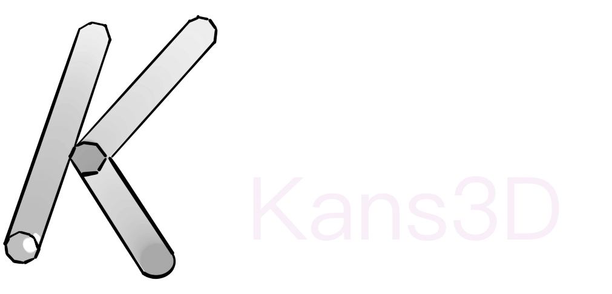
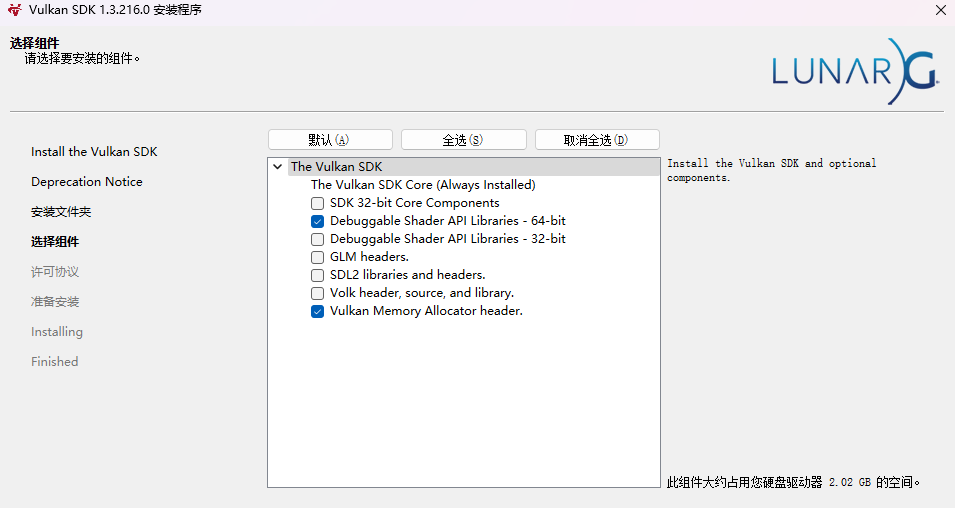

# 	Kans3D-Vulkan(Branch of Kans3D)

  

The **Kans3D** is a Engine for personal learning 

## Continuous build status

| Target platform |               Status               |
| :-------------: | :--------------------------------: |
|     Windows     | passing |

[requirement]()

To build Kans3D, you must first install the following tools.

### Windows 10/11

- Visual Studio 2022 (or more recent)
- python>=3.7
- Git 2.1 (or more recent)

## Build Kans3D

### Build on Windows

You may execute the **Setup.bat**. This batch file will download the requirement and generate the projects of **Kans3D** automatically. After successful build, you can find the Kan3D.sln at the **Root** directory.

Kans3D require VulkanSDK to  pre-process  and compile Shader file ,please check Install option

  

## Documentation

For documentation, will coming soon.

## Extra

Because of the Kans3D is still in developing ,The master branch is the only stable branch,if you switch to another branch may cause crash.
